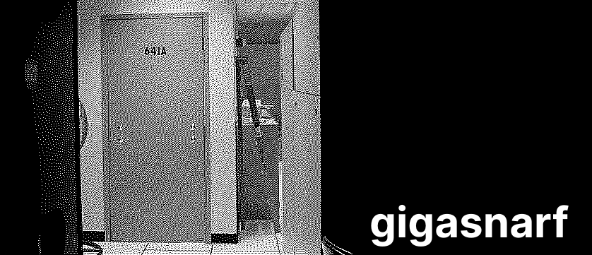

**🚧 Work in progress! 🚧**

Gigasnarf automatically stores a copy of everything you see on the web by monitoring and interpreting the network traffic from either a single computer or an entire network.
It does not insert itself as a proxy, modify any traffic, or intercept encrypted data streams like some systems; instead, it [politely asks](https://gitlab.com/wireshark/wireshark/-/wikis/TLS#tls-decryption:~:text=The%20key%20log%20file%20is%20a%20text%20file%20generated%20by%20applications%20such%20as%20Firefox%2C%20Chrome%20and%20curl%20when%20the%20SSLKEYLOGFILE%20environment%20variable%20is%20set.) browsers and other applications for their private keys and passively reconstructs HTTP(S) exchanges from their network traffic.
This approach is less problematic than [adding a proxy that decrypts and re-encrypts network traffic between you and the internet](https://en.wikipedia.org/wiki/Man-in-the-middle_attack) because you don't have to configure your computer to trust an additional certificate—which, in any context, should raise some eyebrows—or change how encrypted sessions are negotiated at all (some proxies are [more easily tricked](https://www.ftc.gov/system/files/documents/public_comments/2016/09/00019-129028.pdf) into accepting invalid certificates than the browsers behind them, weakening security).
